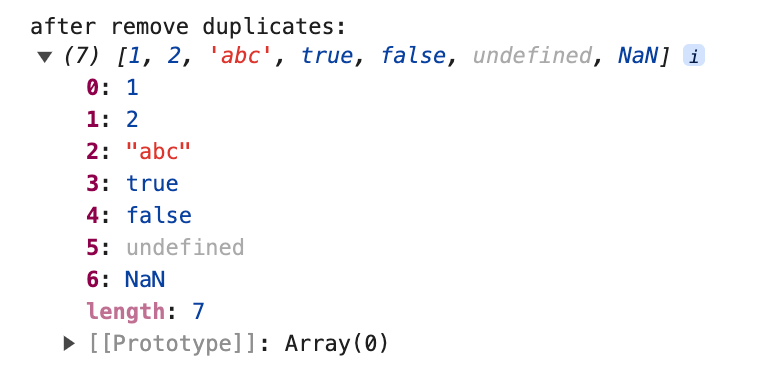
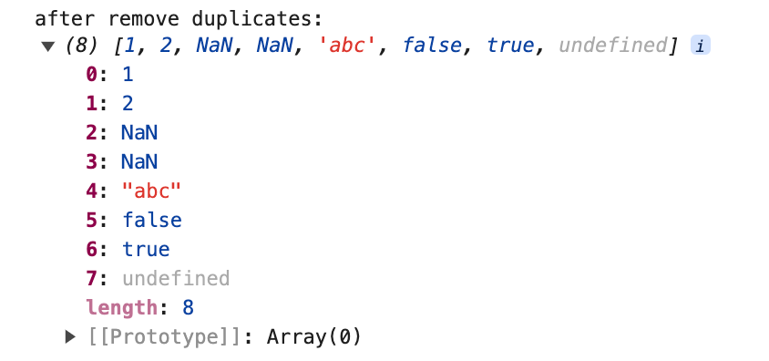
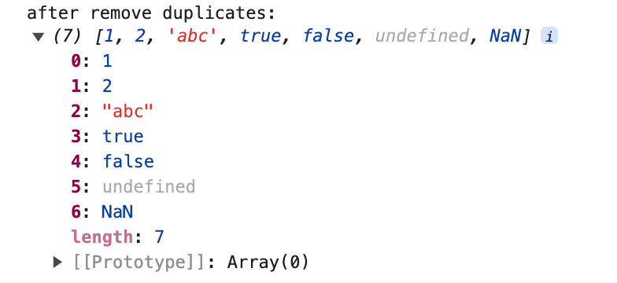

# 7 Ways to Remove Array Duplicates in Javascript


In real development work, we often encounter the handling of a set of data de-duplication. In JavaScript, there are several ways to filter out duplicates from an array, and I'll share with you the different ways of de-duplication in this article.

Here is the array we want to filter out duplicates:


## Set

This is my favorite method for everyday development because it's the easiest to use of all the de-duplication methods.`Set` is a new type introduced by ES6, and the difference between it and `Array` is that the data in the `Set` type can't have duplicate values. Of course, there are some methods of `Array` that `Set` can't call.

```javascript
function unique(arr) {
  return Array.from(new Set(arr));
}
```

First use `new Set()` to convert the original array to `Set` type data, and then convert the `Set` type data to a new array which has been filtered out duplicates. When we talk about `Set` to `Array`, we can use `Array.from()` or we can use structural way `[... .new Set(arr)]`.


`Set` de-duplication also works for `NaN` and `undefined` de-duplication, because both `NaN` and `undefined` can be stored in a `Set`, and NaNs are treated as the same value as each other (although in js: **NaN !== NaN**)

## double for + splice

The array elements are compared one by one in a two-level `for` loop, and duplicates are removed by the `splice` method.

```javascript
function unique(arr) {
  let len = arr.length;
  for (let i = 0; i < len; i++) {
    for (let j = i + 1; j < len; j++) {
      if (arr[i] === arr[j]) {
        arr.splice(j, 1);
        len--;
        j--;
      }
    }
  }
  return arr;
}
```


This method is not able to filter out `NaN` because `NaN !== NaN` when compare.

## indexOf / includes

Create a new empty array, traverse the array that needs to be de-duplicate, push the array elements into the new array, and judge whether the new array already contains the current element before pushing, if not, then push it. This method also cannot filter out `NaN`. To judge whether an array already contains the current element, use the array method `indexOf` or `includes`.

### indexOf

> The [indexOf()](https://developer.mozilla.org/en-US/docs/Web/JavaScript/Reference/Global_Objects/Array/indexOf) method of Array instances returns the first index at which a given element can be found in the array, or -1 if it is not present.

```javascript
function unique(arr) {
  const newArr = [];
  arr.forEach((item) => {
    if (newArr.indexOf(item) === -1) {
      newArr.push(item);
    }
  });
  return newArr;
}
```


### includes

The logic of `includes` is similar to `indexOf`, we can use it to judge whether an array contanins an element.

> The [includes()](https://developer.mozilla.org/en-US/docs/Web/JavaScript/Reference/Global_Objects/Array/includes) method of Array instances determines whether an array includes a certain value among its entries, returning true or false as appropriate.

```javascript
function unique(arr) {
  const newArr = [];
  arr.forEach((item) => {
    if (!newArr.includes(item)) {
      newArr.push(item);
    }
  });
  return newArr;
}
```


Because `includes` can correctly find variables of type `NaN`, it can de-duplicate data of type `NaN`.


We see from the example, `includes(NaN)` returns true, while `indexOf(NaN)` returns -1.

## filter

We can use `filter()` + `indexOf()`.

> The [filter()](https://developer.mozilla.org/en-US/docs/Web/JavaScript/Reference/Global_Objects/Array/filter) method of Array instances creates a shallow copy of a portion of a given array, filtered down to just the elements from the given array that pass the test implemented by the provided function.

The feature of `indexOf` is to return the index of the first position contained in the target to be found, we can filter out only the first item of each individual data, the remaining duplicates will be filtered out.

```javascript
function unique(arr) {
  return arr.filter((item, index) => {
    return arr.indexOf(item) === index;
  });
}
```


Here the output does not contain `NaN`, because `indexOf()` can't judge `NaN`, that is, `arr.indexOf(item) === index` returns false.

## Map / Object

### Map

The `Map` object is a data structure provided by JavaScript that is structured as a key-value pair and remembers the original insertion order of the keys. Any value (object or raw value) can be used as a key or a value. 

```javascript
function unique(arr) {
  const map = new Map();
  const newArr = [];

  arr.forEach((item) => {
    if (!map.has(item)) {
      map.set(item, true);
      newArr.push(item);
    }
  });

  return newArr;
}
```

An array element is stored as a key of a map, and then the `has()` and `set()` methods are combined to determine whether the key is duplicated or not.


`NaN` can also be de-duplicated after using `Map()`, because `Map` makes a judgment that `NaN` is equal to `NaN`, leaving all other values to be judged as equal or not based on the result of the `===` operator.

### Object

Use `Object` type to filter out is is similar to use` Map`, this way mainly using the feature that property name of the object can not be repeated.

```javascript
function unique(arr) {
  const newArr = [];
  const obj = {};

  arr.forEach((item) => {
    if (!obj[item]) {
      newArr.push(item);
      obj[item] = true;
    }
  });

  return newArr;
}
```



## sort

Use `sort()` to sort, then traverse and compare neighboring elements based on the sorted result.

```javascript
function unique(arr) {
  arr = arr.sort();
  let newArr = [];
  for (let i = 0; i < arr.length; i++) {
    arr[i] === arr[i - 1] ? newArr : newArr.push(arr[i]);
  }
  return newArr;
}
```
If the current item is not equal to the previous item, push into the new array.



This method changes the original position of the array and cannot de-duplicate `NaN` data.

## reduce

The `reduce()` executes a callback function for each element of the array in turn, taking four arguments: the initial value initialValue (or the return value of the previous callback function), the current element value, the current index, and the array from which reduce was called.

```javascript
function unique(arr) {
  return arr.reduce((prev, next) => {
    return prev.includes(next) ? prev : [...prev, next];
  }, []);
}
```

When initializing, we define a new array, and each time we loop, we determine whether the values of the old array have already been stored in the new array, and if not, we add them to the new array.



Thanks for reading!
