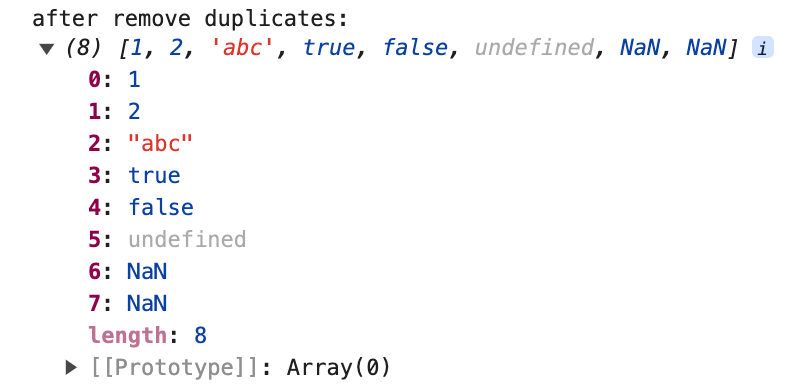
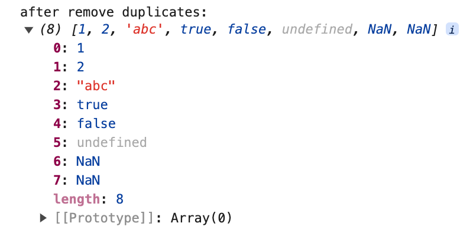
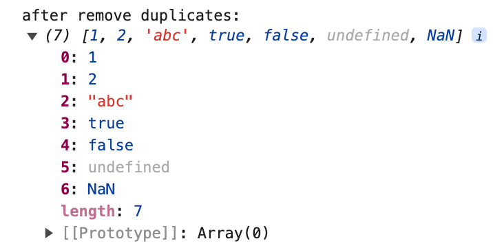
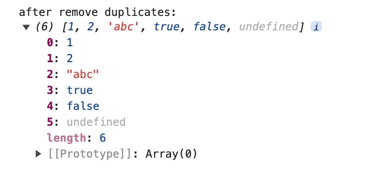
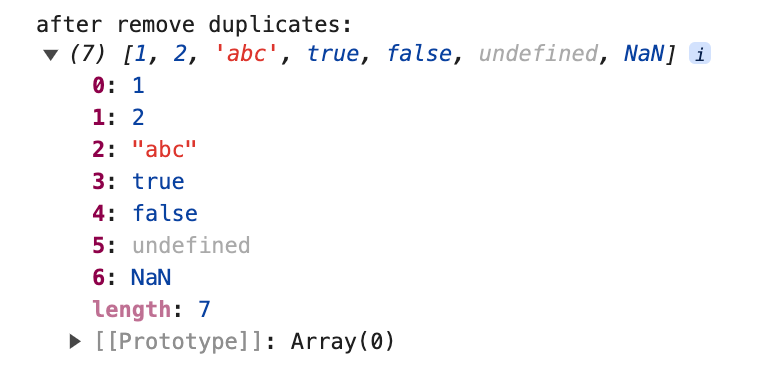

# 7 Ways to Remove Array Duplicates in Javascript


In real development work, we often encounter the handling of a set of data de-duplication. In JavaScript, there are several ways to filter out duplicates from an array, and I'll share with you the different ways of de-duplication in this article.

Here is the array we want to filter out duplicates:


## Set

This is my favorite method for everyday development because it's the easiest to use of all the de-duplication methods.`Set` is a new type introduced by ES6, and the difference between it and `Array` is that the data in the `Set` type can't have duplicate values. Of course, there are some methods of `Array` that `Set` can't call.

```javascript
function unique(arr) {
  return Array.from(new Set(arr));
}
```

First use `new Set()` to convert the original array to `Set` type data, and then convert the `Set` type data to a new array which has been filtered out duplicates. When we talk about `Set` to `Array`, we can use `Array.from()` or we can use structural way `[... .new Set(arr)]`.


`Set` de-duplication also works for `NaN` and `undefined` de-duplication, because both `NaN` and `undefined` can be stored in a `Set`, and NaNs are treated as the same value as each other (although in js: **NaN !== NaN**)

## double for + splice

The array elements are compared one by one in a two-level `for` loop, and duplicates are removed by the `splice` method.

```javascript
function unique(arr) {
  let len = arr.length;
  for (let i = 0; i < len; i++) {
    for (let j = i + 1; j < len; j++) {
      if (arr[i] === arr[j]) {
        arr.splice(j, 1);
        len--;
        j--;
      }
    }
  }
  return arr;
}
```



This method is not able to filter out `NaN` because `NaN !== NaN` when compare.

## indexOf / includes

Create a new empty array, traverse the array that needs to be de-duplicate, push the array elements into the new array, and judge whether the new array already contains the current element before pushing, if not, then push it. This method also cannot filter out `NaN`. To judge whether an array already contains the current element, use the array method `indexOf` or `includes`.

### indexOf

The [indexOf()](https://developer.mozilla.org/en-US/docs/Web/JavaScript/Reference/Global_Objects/Array/indexOf) method of Array instances returns the first index at which a given element can be found in the array, or -1 if it is not present.

```javascript
function unique(arr) {
  const newArr = [];
  arr.forEach((item) => {
    if (newArr.indexOf(item) === -1) {
      newArr.push(item);
    }
  });
  return newArr;
}
```



### includes

The logic of `includes` is similar to `indexOf`, we can use it to judge whether an array contanins an element.

The [includes()](https://developer.mozilla.org/en-US/docs/Web/JavaScript/Reference/Global_Objects/Array/includes) method of Array instances determines whether an array includes a certain value among its entries, returning true or false as appropriate.

```javascript
function unique(arr) {
  const newArr = [];
  arr.forEach((item) => {
    if (!newArr.includes(item)) {
      newArr.push(item);
    }
  });
  return newArr;
}
```



Because `includes` can correctly find variables of type `NaN`, it can de-duplicate data of type `NaN`.


We see from the example, `includes(NaN)` returns true, while `indexOf(NaN)` returns -1.

## filter

利用数组的 filter()+indexOf()

filter() 方法：会创建一个新数组，其包含通过所提供函数实现的测试的所有元素，我们可以结合 indexOf 方法进行判断。
而 indexOf 的特性是返回被查找的目标中包含的第一个位置的索引，我们可以只筛选出每一个独立数据的第一项，剩余重复的则过滤掉。

```javascript
function unique(arr) {
  return arr.filter((item, index) => {
    return arr.indexOf(item) === index;
  });
}
```



这里的输出结果中不包含 NaN，是因为 indexOf()无法对 NaN 进行判断，即 arr.indexOf(item) === index 返回结果为 false

## Map / Object

### Map

Map 对象是 JavaScript 提供的一种数据结构，结构为键值对形式，并且能够记住键的原始插入顺序，任何值（对象或者原始值）都可以作为一个键或一个值。将数组元素作为 map 的键存入，然后结合 has()和 set()方法判断键是否重复。

```javascript
function unique(arr) {
  const map = new Map();
  const newArr = [];

  arr.forEach((item) => {
    if (!map.has(item)) {
      map.set(item, true);
      newArr.push(item);
    }
  });

  return newArr;
}
```



使用 Map()也可对 NaN 去重，原因是 Map 进行判断时认为 NaN 是与 NaN 相等的，剩下所有其它的值是根据 === 运算符的结果判断是否相等。

### 对象

实现思想和 Map()是差不多的，主要是利用了对象的属性名不可重复这一特性。

```javascript
function unique(arr) {
  const newArr = [];
  const obj = {};

  arr.forEach((item) => {
    if (!obj[item]) {
      newArr.push(item);
      obj[item] = true;
    }
  });

  return newArr;
}
```


## sort

利用 sort() 排序方法，然后根据排序后的结果进行遍历及相邻元素比对。

```javascript
function unique(arr) {
  arr = arr.sort();
  let newArr = [];
  for (let i = 0; i < arr.length; i++) {
    arr[i] === arr[i - 1] ? newArr : newArr.push(arr[i]);
  }
  return newArr;
}
```
如果当前项不等于前一项，则push进新数组中。


这种方法会改变数组原有位置，而且无法对NaN数据去重。

## reduce
reduce() 方法对数组中的每个元素执行一个由您提供的reduce函数(依次执行)，将其结果汇总为单个返回值。 reduce 为数组中的每一个元素依次执行回调函数，接受四个参数：初始值 initialValue（或者上一次回调函数的返回值），当前元素值，当前索引，调用 reduce 的数组。

```javascript
function unique(arr) {
  return arr.reduce((prev, next) => {
    return prev.includes(next) ? prev : [...prev, next];
  }, []);
}
```

初始化时我们定义了一个新数组，每次循环都判断新数组中是否已经存储了旧数组的值，没有则添加进新数组。


感谢阅读！
