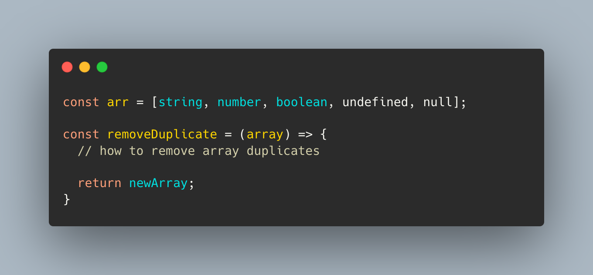
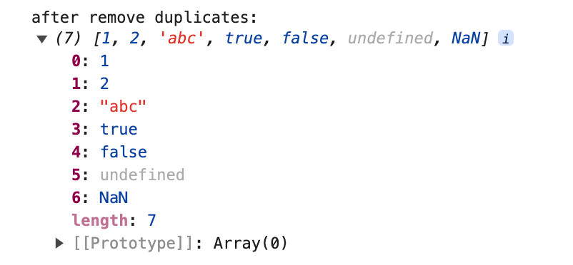
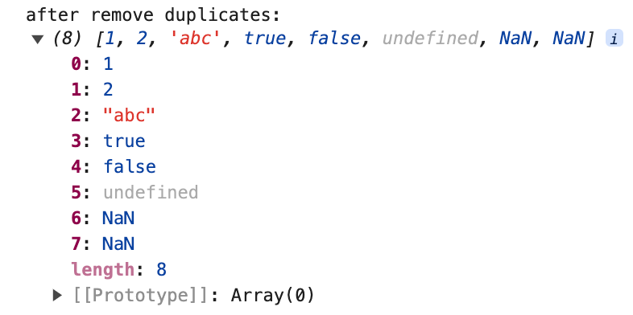
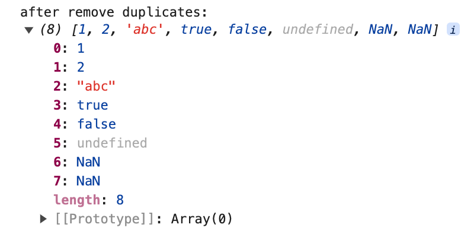
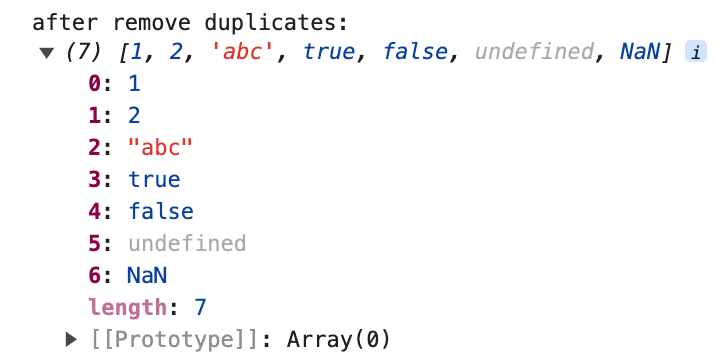
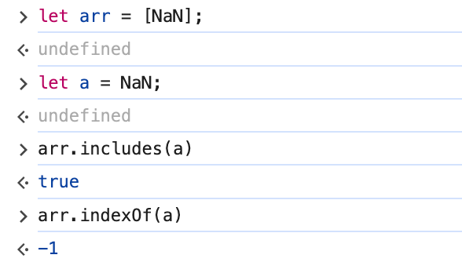
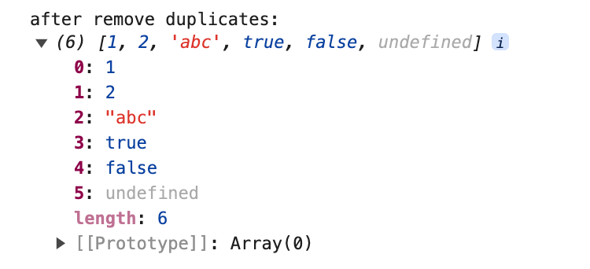
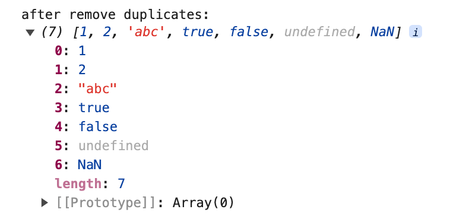
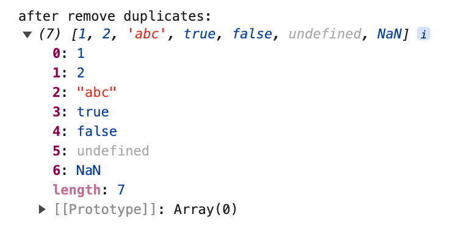
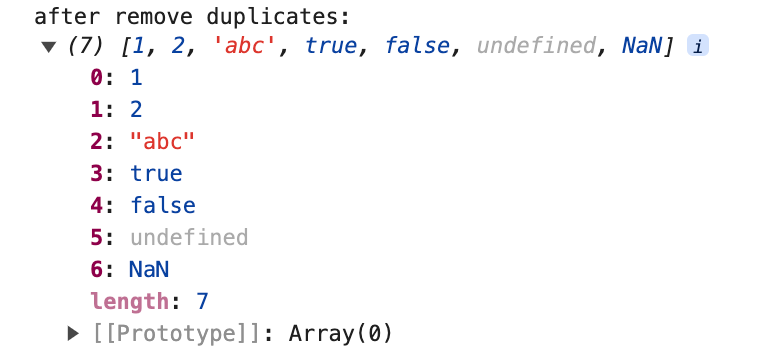

# 数组去重的方式

;

在实际开发工作中，我们时常会遇到对一组数据去重的处理。在 JavaScript 中，有多种方法可以实现数组去重，我会通过这篇文章来和你分享不同的去重方式。

以下是我们要进行去重的数组数据：

```javascript
let arr = [
  1,
  2,
  2,
  "abc",
  "abc",
  true,
  true,
  false,
  false,
  undefined,
  undefined,
  NaN,
  NaN,
];
```

## Set

这个方法是我日常开发中最喜欢用的方法，因为，他的使用方法是所有去重中最简单的。Set 是 ES6 新推出的一种类型，它和数组的区别在于，Set 类型中的数据不可以有重复的值。当然，数组的一些方法 Set 也无法调用。

```javascript
function unique(arr) {
  return Array.from(new Set(arr));
}
```

先使用`new Set()`将原数组转成 Set 类型数据，然后对 Set 类型数据再进行数组类型的转换，得到去重后的数组。在讲 Set 转成 Array 时，我们可以使用`Array.from()`也可以使用结构的方式`[...new Set(arr)]`。


使用 Set 的方式去重对 NaN 和 undefined 类型去重也是有效的，是因为 NaN 和 undefined 都可以被存储在 Set 中， NaN 之间被视为相同的值（尽管在 js 中：NaN !== NaN）

## 双层循环 + splice

通过两层循环对数组元素进行逐一比较，然后通过 splice 方法来删除重复的元素。

```javascript
function unique(arr) {
  let len = arr.length;
  for (let i = 0; i < len; i++) {
    for (let j = i + 1; j < len; j++) {
      if (arr[i] === arr[j]) {
        arr.splice(j, 1);
        len--;
        j--;
      }
    }
  }
  return arr;
}
```



此方法对 NaN 是无法进行去重的，因为进行比较时 NaN !== NaN。

## indexOf / includes

新建一个空数组，遍历需要去重的数组，将数组元素存入新数组中，存放前判断数组中是否已经含有当前元素，没有则存入。此方法也无法对 NaN 去重。判断数组中是否已经含有当前元素的方式可以使用 indexOf 或 includes 方法。

### indexOf

indexOf() 方法：返回调用它的对象中第一次出现的指定值的索引，从 fromIndex 处进行搜索。如果未找到该值，则返回 -1。

```javascript
function unique(arr) {
  const newArr = [];
  arr.forEach((item) => {
    if (newArr.indexOf(item) === -1) {
      newArr.push(item);
    }
  });
  return newArr;
}
```



### includes

此方法逻辑与 indexOf 方法去重异曲同工，只是用 includes 方法来判断是否包含重复元素。

includes()方法：用来判断一个数组是否包含一个指定的值，根据情况，如果包含则返回 true，否则返回 false。

```javascript
function unique(arr) {
  const newArr = [];
  arr.forEach((item) => {
    if (!newArr.includes(item)) {
      newArr.push(item);
    }
  });
  return newArr;
}
```



因为 includes 能够正确找到 NaN 类型的变量，所以能够对 NaN 类型的数据进行去重。



从例子中可以看到，includes(NaN)返回 true，而 indexOf(NaN)则返回-1。

## filter

利用数组的 filter()+indexOf()

filter() 方法：会创建一个新数组，其包含通过所提供函数实现的测试的所有元素，我们可以结合 indexOf 方法进行判断。
而 indexOf 的特性是返回被查找的目标中包含的第一个位置的索引，我们可以只筛选出每一个独立数据的第一项，剩余重复的则过滤掉。

```javascript
function unique(arr) {
  return arr.filter((item, index) => {
    return arr.indexOf(item) === index;
  });
}
```



这里的输出结果中不包含 NaN，是因为 indexOf()无法对 NaN 进行判断，即 arr.indexOf(item) === index 返回结果为 false

## Map / Object

### Map

Map 对象是 JavaScript 提供的一种数据结构，结构为键值对形式，并且能够记住键的原始插入顺序，任何值（对象或者原始值）都可以作为一个键或一个值。将数组元素作为 map 的键存入，然后结合 has()和 set()方法判断键是否重复。

```javascript
function unique(arr) {
  const map = new Map();
  const newArr = [];

  arr.forEach((item) => {
    if (!map.has(item)) {
      map.set(item, true);
      newArr.push(item);
    }
  });

  return newArr;
}
```



使用 Map()也可对 NaN 去重，原因是 Map 进行判断时认为 NaN 是与 NaN 相等的，剩下所有其它的值是根据 === 运算符的结果判断是否相等。

### 对象

实现思想和 Map()是差不多的，主要是利用了对象的属性名不可重复这一特性。

```javascript
function unique(arr) {
  const newArr = [];
  const obj = {};

  arr.forEach((item) => {
    if (!obj[item]) {
      newArr.push(item);
      obj[item] = true;
    }
  });

  return newArr;
}
```



## sort

利用 sort() 排序方法，然后根据排序后的结果进行遍历及相邻元素比对。

```javascript
function unique(arr) {
  arr = arr.sort();
  let newArr = [];
  for (let i = 0; i < arr.length; i++) {
    arr[i] === arr[i - 1] ? newArr : newArr.push(arr[i]);
  }
  return newArr;
}
```
如果当前项不等于前一项，则push进新数组中。


这种方法会改变数组原有位置，而且无法对NaN数据去重。

## reduce
reduce() 方法对数组中的每个元素执行一个由您提供的reduce函数(依次执行)，将其结果汇总为单个返回值。 reduce 为数组中的每一个元素依次执行回调函数，接受四个参数：初始值 initialValue（或者上一次回调函数的返回值），当前元素值，当前索引，调用 reduce 的数组。

```javascript
function unique(arr) {
  return arr.reduce((prev, next) => {
    return prev.includes(next) ? prev : [...prev, next];
  }, []);
}
```

初始化时我们定义了一个新数组，每次循环都判断新数组中是否已经存储了旧数组的值，没有则添加进新数组。



感谢阅读！